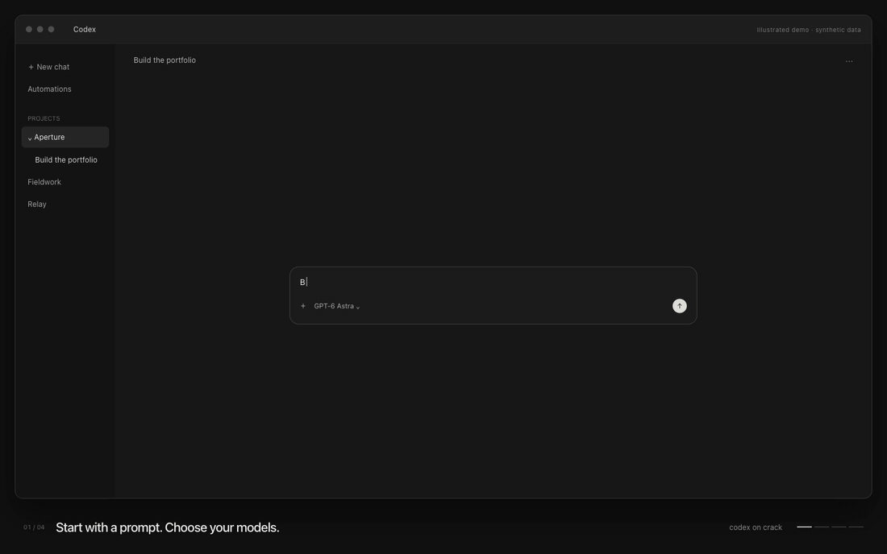

# Codex on Crack

**Run your models together. Keep the work in Codex.**

Previously **Astra Flash Orchestrator**. The original Astra + Flash workflow grew
into a package for planning, delegation, tool handoffs, and reviewing work across
your configured models. [Upgrading from the original? Start here.](docs/UPGRADING.md)

> Run subagents through Opus 5.5.

> Have Opus plan this and Flash implement it. Bring the result back for review.

> Help me choose which of my models should work on this project.

You describe the work. The skills find the supported route in your setup, agree
on the plan with you, and carry the assignment through implementation and review.
You don't have to explain the CLI or your subscription in every prompt.



*15-second illustrated walkthrough with a recreated Codex interface and synthetic
project data. The workflow is condensed; this is not a live build recording.*

[Install](INSTALL-IN-CODEX.md) · [Upgrade](docs/UPGRADING.md) ·
[Workflow](docs/WORKFLOW.md) · [Panel](plugins/codex-on-crack-panel/README.md) ·
[OpenCode / original installer](INSTALL-IN-OPENCODE.md)

## One conversation, different models

Your selected **Codex model** keeps the conversation, coordinates the work, and
uses the host's available tools. It can delegate to a compatible native worker,
including a model configured through Codex Router.

**Opus 5.5** can implement a whole assignment through your authenticated Claude
Code client. It can also plan and review the build while Codex dispatches a native
worker, such as **DeepSeek V4.1 Flash**, for implementation. Codex returns worker
results and host-tool evidence to the lead.

That means you can use Claude for a build and still ask the Codex host to check
it in the browser, use available computer tools, or generate an image. External
Claude sessions do not directly inherit Codex tools or replace the model selected
in your composer. The host performs those steps.

| Arrangement | Who does what |
| --- | --- |
| Codex host + native worker | The host scopes and reviews; a compatible configured worker implements. |
| Codex host + Opus | Opus implements through Claude Code; Codex coordinates and validates. |
| Codex host + Opus + native worker | Opus plans and reviews; Codex handles dispatch and tool requests; the worker implements. |
| Just the current model | Small tasks and explicit solo work stay in the current conversation. |

Model choice is yours. Recommendations use your configured roles, preferences,
and declared capabilities. The package doesn't benchmark every model or silently
substitute another model or billing route. The current Claude adapter targets
`claude-opus-5-5`; other Claude models are not automatically supported by it.

## See what is happening

The optional panel lives alongside your conversation as an embedded MCP App in
supported Codex hosts. A localhost view is available as a fallback.

Choose a workspace first. Its **Overview**, **Review**, and **Usage & routes**
then show only that project's registered work:

- Follow phases, agents, model handoffs, and recorded tool activity.
- Inspect per-run timing and available input, output, and cache counters.
- Answer visual questions and leave feedback while the conversation continues.
- Keep decisions tied to the screenshot revision you actually reviewed.
- Record registered sources and export an offline replay for later inspection.

Feedback is saved for the agent to read at a natural checkpoint. Sending it does
not interrupt the conversation or count as approval. Explicit approval is a
separate action. Register the sessions and runs you want to observe; the panel
doesn't automatically read every conversation on your computer.

## Install

You need **Node.js 24.15+**, a Codex client with plugin support, and your own model
access. Native workers need a compatible configured route. Claude mode needs
the official Claude Code CLI, authenticated through your subscription.

From this checkout in a stable folder:

```sh
codex plugin marketplace add "$PWD"
codex plugin add codex-on-crack@codex-on-crack
```

Add the panel if you want it:

```sh
codex plugin add codex-on-crack-panel@codex-on-crack
```

Start a fresh conversation:

> Help me plan this project. Check which models I have available, recommend
> who should do what, and agree on the plan with me before building.
> Connect this workspace and its runs to the Codex on Crack panel.

The three core skills are **crack-plan** (plan and choose), **crack-setup**
(configure workers with preview and undo), and **crack** (execute and review).

For existing Astra Flash Orchestrator installations, read the
[upgrade guide](docs/UPGRADING.md) before switching policies.
Setup does not run paid model requests. Builds use the model access you authorize.

## What changed from Astra Flash Orchestrator?

The original package prescribed one arrangement: Astra plans and reviews, Flash
builds. That is still a useful arrangement. Codex on Crack extends the idea to
other configured workers, a Claude Code execution route, project-lead handoffs,
and a panel for following and reviewing the work.

The name changed because the package is no longer tied to two models.
It is still built around a scoped assignment and a lead checking the result.

## Judge the result, then the usage

Does the finished product work? Does it look right? How much repair did it need?
Those questions come before token totals.

Moving work to another provider can preserve Codex allowance while adding costs
elsewhere. Tokens are not weekly allowance, and subscription dollar estimates
are not API bills. Resumed sessions may contain cumulative counters. The panel
keeps missing information unknown rather than estimating it.

The original usage result described a particular test. It is not a universal
savings promise for this package or every model combination.
[Record your own build](docs/RECORDING.md) to see what helps your work.

## Before you use it

This is a preview release. See [troubleshooting](docs/TROUBLESHOOTING.md) for
setup and compatibility issues. Instructions and file scopes are not an OS sandbox.
Your selected model, credentials, and permissions stay under your control.
Use one active orchestration policy per task.

[Documentation](docs/README.md) · [Troubleshooting](docs/TROUBLESHOOTING.md) ·
[Contributing](CONTRIBUTING.md) · [Security](SECURITY.md) · [Sources](SOURCES.md)

MIT licensed. Not affiliated with OpenAI, Anthropic, or DeepSeek.
